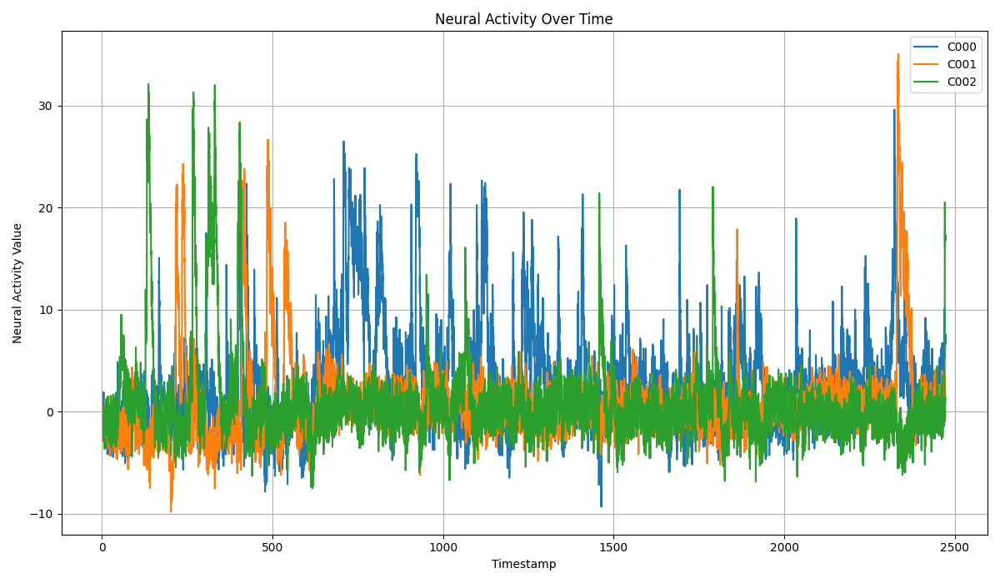
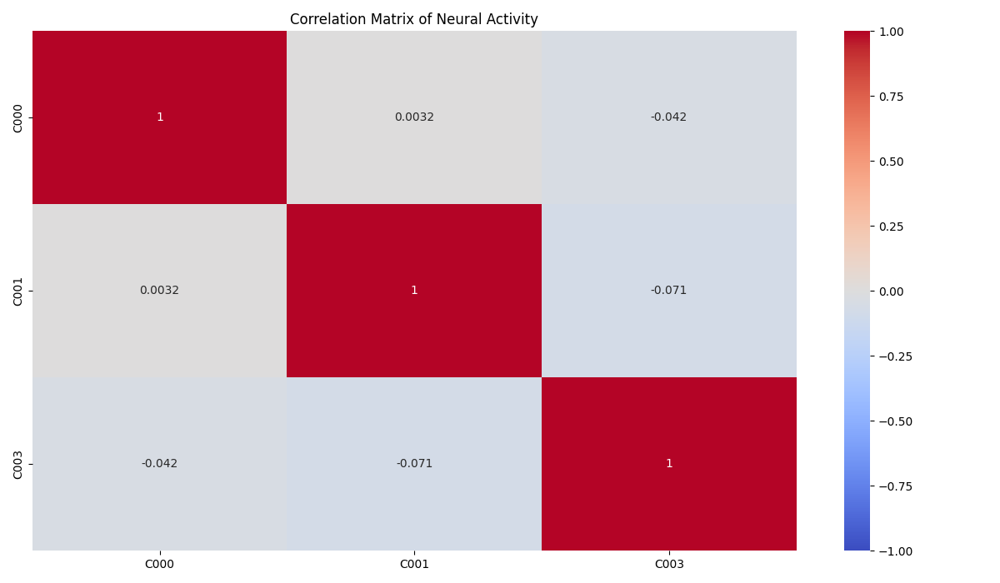

# Synchrony-Anaysis-Pipeline-SE4S

SE4S 2023

Team Members: Maya Paulson, Emma Keppler, Deanna Gelosi, and Philipp Wunsch

## Overview

In this pipeline, cell data across two animals is compared for synchronization. The sample data used is from prairie voles, which are known to form pair bonds.

### Research Question

Will voles have increased synchronization when interacting with their partner than interacting with a novel vole?

### Background

Prairie voles are a model organism used to study the neural mechanisms of social bonds. Voles form pair bonds, preferring to spend time with their partner and are aggressive towards unfamiliar voles Synchronization occurs when neurons in two different animals have rhythmically aligned activity. In humans, synchronized activity is related to prosocial behaviors and is disrupted in several neurological disorders like ASD.

### Features

The workflow for this pipeline includes:

- A data loader (`load_data.py`) to input animal cell data and time.
- Data normalization (`normalize_data.py`) to compare cell data between animals.
- Correlation (`correlations.py`) between two animals' normalized data, saving two data frames of p_values and R_values, respectively. Highly correlated cell pairs are then identified.
- A query of cell pair correlations (`cell_slicer.py`) that identifies cell pairs that have significant correlations or the highest levels of correlation.
- Visualizations of cell activity over time and a correlation matrix of neural activity are rendered (`create_plots.py`).

Documentation of main analysis and graphing functions with example output are found in doc/Tutorial.ipynb jupyter notebook. Example plot pngs can also be found in doc directory.

## How To Run

1. In the terminal, clone this repo.

    ```
    https://github.com/mupaulson/Synchrony-Anaysis-Pipeline-SE4S.git
    ```

2. Navigate to the repo directory.

    ```
    cd Synchrony-Analysis-Pipeline-SWE4S
    ```

3. Add data to the data directory, or use the provided test data.

#### Single Animal Visualization:
4. To create plots, navigate to the src directory.

    ```
    cd src/
    ```

5. Generate plots using the following command line structure.
    ```bash
    python create_plots.py -f [data_file.csv] -c [cell_names] -o [output_filename.png] -p [plot_type]
    ```

    ```
        -f, --file: Path to the data CSV file (required).
        -c, --cells: List of cell names for the plot (required).
        -o, --output: Filename for the output (default "output.png").
        -p, --plot_type: Type of plot (line or correlation, default line).
    ```

6. For a line plot, run the following line.

    ```bash
    python src/create_plots.py -f data/4659_aligned_traces.csv -c C000 C001 C002 -o line_plot.png -p line
    ```




7. For a correlation matrix heatmap plot, run the following line.

*Important Release Note: The correlation matrix heatmap plot only supports ***two*** cells right now due to limitation in lib functions. We will add support for more cells in the future.*

    ```bash
    python src/create_plots.py -f data/4659_aligned_traces.csv -c C000 C001 -o correlation_matrix.png -p correlation
    ```


#### Snakemake functionalization
8. To run the sample data, run snakemake as is:

    ```
    cd src/
    snakemake -c 1
    ```
    You can specify how many cores snakemake runs (more is faster) by changing the integer after -c
    snakemake at current functionality will run through all analysis steps but will not run visualizations.

To add your own data to the snakemake pipeline:

9. add files to the data directory

10. edit the file data/schedule_test.csv to have the correct file names in the File_Name column (relative path must be correct too) and correct animal numbers in the Animal_Num column

11. In the snakefile, you can specify which endpoint you would like. It is currently set to run the normalization, correlation and slice for significant cells. To change the endpoint, edit the rule all (line 91):

    ```
    rule all:
        input:
    91:     expand('../output_data/{out_file}', out_file=get_rule('../data/schedule_test.csv', 'sig'))
    ```
     edit the final string (currently 'sig') to any of these options: 'norm_out' (will end after normalizing data), 'correlation' (will end after making correlation matrix), 'sig' (will end with signifcant cell pairs), or 'top' (will end with top 1% of cells correlated).

12. Repeat step 8 to run snakemake with these changes

## Testing

### Unit Tests

1. Navigate into the unit_test directory.

    ```bash
    cd tests/unit_tests
    ```

2. Run unit tests.

   ```bash
   python3 -m unittest test_animal_data.py  
   ```

### Functional Tests

1. Navigate into the functional_test directory.

    ```bash
    cd tests/functional_tests
    ```

2. Run functional tests.

    ```bash
    chmod +x test_load_data.sh
    ./test_load_data.sh 
    ```

### Style Tests

1. Navigate into the top level directory.

2. Install `pycodestyle`.

    ```
        - run: pip install pycodestyle
    ```

3. Run `pycodestyle` on all Python files in the repo.
    ```
    pycodestyle $(git ls-files "*.py")
    ```
